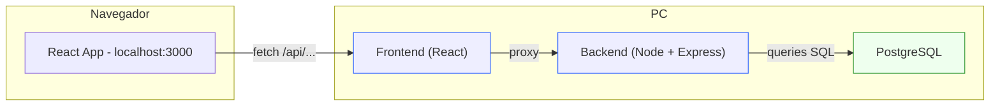

# Sistema de Portaria

🚪 Projeto de um sistema de portaria para controle de visitantes, moradores e acessos em condomínios.

---

## 🎯 Objetivo
Auxiliar o porteiro e o síndico geral no registro de entradas e saídas, aumentando a segurança e organização do condomínio.

---

## 🛠️ Stack Tecnológica
- **Frontend:** React  
- **Backend:** Node.js (Express)  
- **Banco de dados:** PostgreSQL  
- **Versionamento:** Git + GitHub  
- **Documentação:** Markdown / Figma (wireframes)

---

## 📝 Funcionalidades Planejadas (MVP)
1. Registro e check-in de visitantes  
2. Registro de saída (check-out)  
3. Listagem de visitantes ativos (“Dentro agora”)  
4. Busca de registros por nome, documento, placa ou data  
5. Relatório diário simples de entradas e saídas

---

## 📂 Estrutura do Repositório

```bash
sistema-portaria/
├── docs/
│   ├── dicionario-de-dados.md
│   └── fluxos-e-wireframes.md
├── src/
│   ├── backend/
│   │   ├── nodemon.json
│   │   ├── package-lock.json
│   │   ├── package.json
│   │   ├── README.md
│   │   └── server.js
│   └── frontend/
│       ├── public/
│       ├── src/
│       │   ├── App.css
│       │   ├── App.js
│       │   ├── App.test.js
│       │   ├── index.css
│       │   ├── index.js
│       │   ├── logo.svg
│       │   ├── reportWebVitals.js
│       │   └── setupTests.js
│       ├── package-lock.json
│       └── package.json
├── tests/
│   ├── backend/
│   └── frontend/
├── .gitignore
├── CHANGELOG.md
├── CONTRIBUTING.md
├── LICENSE.md
└── README.md
```


---

## 🚀 Como Rodar (Futuro)
> Ainda não implementado. Quando iniciar o desenvolvimento, aqui estarão os comandos para:  
- Instalar dependências (`npm install`)  
- Rodar backend (`npm run dev`)  
- Rodar frontend (`npm start`)  
- Configurar banco PostgreSQL  

---

## 📖 Documentação
- Wireframes: [Link do Figma](https://www.figma.com/design/uOKJ11RVZh5nPQo6SciOs2/Wireframes-%E2%80%93-Sistema-de-Portaria?node-id=0-1&t=Gy1r6fvHdnMcttzx-1)  
- Detalhes de regras de negócio, user stories e dicionário de dados: pasta `docs/`

---

## Arquitetura do Ambiente de Desenvolvimento

Este diagrama mostra como os serviços se comunicam durante o desenvolvimento local:





---

## 👨‍💻 Autor
Gabriel Bueno